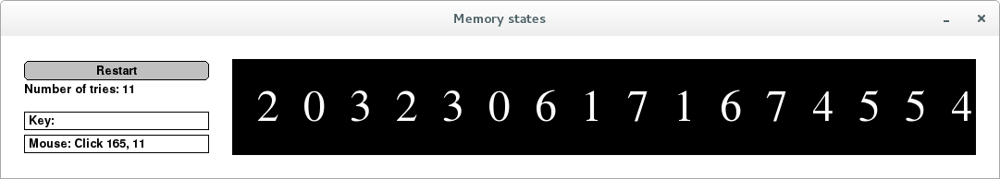


# An Introduction to Interactive Programming in Python (Part 2) 

Coursera course

## Week 5

NEVER remove things from a list while you are iterating it.

```python
for x in y:
    ...loop body...
```

The loop body will execute once for each element of the list y
and the loop body will have access to that element as x.

### Project: Game of Memory

At the end of this week, I built a Memory Game project.
My GF is super good at this, and beats me easily.
Here is her 2nd try:


